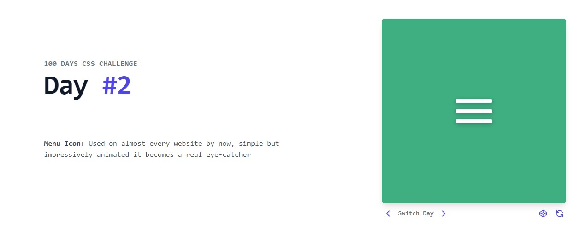

# CSS-Challenges

100 days of CSS challenges. 🎨🖌

<h2>Challenge #1</h2>

An easy start into the challenge with a custom build number with gradient. 🟦⬛

Access through this <a href="https://valvrauu.github.io/CSS-Challenges/challenge-1/assets/index.html" target="_blank">link</a>.

<h2>Challenge #2</h2>

Used on almost every website by now, simple but impressively animated it becomes a real eye-catcher. 🟩⬛

Access through this <a href="https://valvrauu.github.io/CSS-Challenges/challenge-2/assets/index.html" target="_blank">link</a>.
