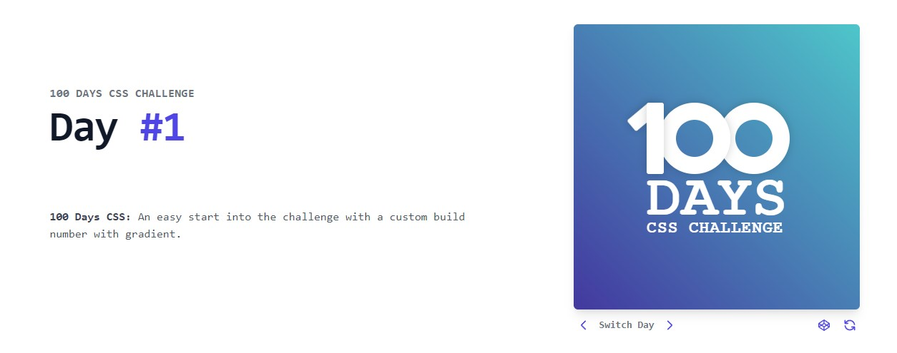

# CSS-Challenges

100 days of CSS challenges. 🎨🖌

<h2>Challenge #1</h2>

An easy start into the challenge with a custom build number with gradient. 🟦⬛

Access through this <a href="challenge-1/assets/index.html" target="_blanck">link</a>.
